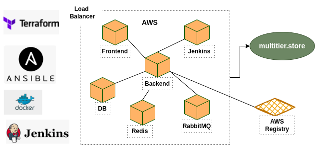

Вот адаптированное описание **облачного варианта проекта** на **Terraform + Ansible + Docker + Jenkins + AWS ECR**, оформленное в том же стиле, что и ваш локальный проект, и на русском языке:

---

## JavaStack Облачный проект

### Автоматизированное развёртывание многоуровневого веб-приложения в AWS

---

## 🛠 Требования

Для выполнения проекта необходимо установить и настроить следующие инструменты:

* Git, Bash, любой текстовый редактор
* AWS CLI (сконфигурирован через `aws configure`)
* Terraform
* Ansible
* Docker
* Jenkins (можно локально или в EC2)
* Созданный SSH-ключ (`~/.ssh/id_rsa.pub`)
* Учетная запись в AWS с доступом к EC2, ECR, VPC и IAM

---

## 🧱 Архитектура проекта



В этом проекте развёртывание производится в **облаке AWS**, используя:

* **Terraform** — для создания инфраструктуры (EC2, VPC, Security Groups и т.д.)
* **Ansible** — для настройки всех компонентов на серверах
* **Docker** — для упаковки приложения
* **Jenkins** — для CI/CD пайплайна
* **ECR** — для хранения Docker-образов

---

## 🔑 Основные команды Terraform

Перейдите в каталог `terraform/` и выполните:

```bash
terraform init
terraform apply
```

Создастся инфраструктура:

* 5 EC2-инстансов: `frontend`, `backend`, `db`, `redis`, `rabbitmq`
* VPC, подсети, интернет-шлюз
* Security Groups
* SSH доступ по ключу

Остановить инфраструктуру:

```bash
terraform destroy
```

---

## 📂 Настройка через Ansible

После развёртывания Terraform получаем IP-адреса машин и заполняем файл `inventory.ini`:

```ini
[frontend]
3.XX.XX.10

[backend]
3.XX.XX.11

[db]
3.XX.XX.12

[redis]
3.XX.XX.13

[rabbitmq]
3.XX.XX.14
```

Затем запускаем Playbook:

```bash
ansible-playbook -i inventory.ini playbook.yml
```

Ansible выполнит:

* Установку всех необходимых сервисов
* Настройку Nginx, Tomcat, MySQL, Redis, RabbitMQ
* Копирование `application.properties`

---

## 🐳 Docker-образ приложения

Создание Dockerfile multistage
далее разделение на Dockerfile.build и Dockerfile.run 
для pipeline
---

## 🔁 Jenkins CI/CD

Создайте `Jenkinsfile`

---

## 🌐 Проверка

* Nginx: `http://<frontend-IP>/`
* Приложение (Tomcat): `http://<backend-IP>:8080/`
* RabbitMQ Web UI: `http://<rabbitmq-IP>:15672`
* Redis, MySQL: только через внутренние порты

---


